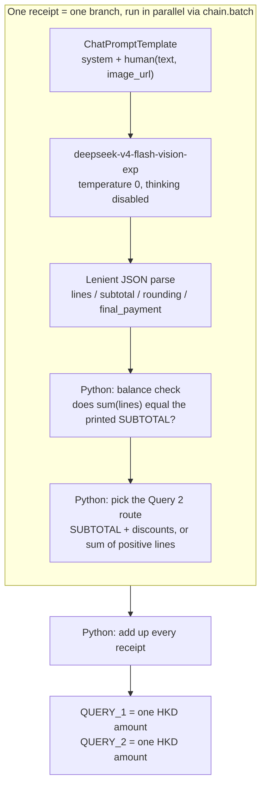

# FTEC5660 Homework 1: Receipt Chain

Build a LangChain pipeline that reads every supermarket receipt in a folder
with the vision-capable DeepSeek Flash model and answers these two questions:

1. How much money did I spend in total for these bills?
2. How much would I have had to pay without the discount?

For this homework, **amount spent** means the final payment after the receipt's
rounding line. **Without the discount** means the sum of the original positive
item prices: add back every promotion, coupon, member, app, packaging-damage,
and percentage discount, but do not add back rounding.

## Student task

Only edit the two functions in `hw1.py` that contain `### YOUR CODE HERE`:

- `build_chain()` creates your LangChain chain.
- `answer_queries()` runs the chain on the receipt images and returns one final
  response for each question.

You may use prompt chaining, routing, parallel calls, reflection, or a
combination. Your final responses should each contain one HKD amount. Do not
hard-code filenames or public answers; grading uses unseen receipt folders.

## Setup and public test

```bash
python3 -m venv .venv
source .venv/bin/activate
pip install -r requirements.txt
```

Put your DeepSeek key after `DEEPSEEK_API_KEY=` in `.env`, then run:

```bash
python3 hw1.py --image-folder public_test
```

The program creates `results.csv` in the current directory. Its columns are
`query`, `model_response`, and `correctness`. The public answers are in
`public_test/ground_truth.json`. The starter intentionally returns the dummy
response `please design your chain to answer these two queries.` so it runs
before you add any API code.

The required model is `deepseek-v4-flash-vision-exp`, the vision-capable
DeepSeek Flash model. JPEG, PNG, GIF, and WebP inputs are accepted by the
homework runner.


## Homework 1 solution: 
### Chain design



### How it works

The model never does arithmetic. It only transcribes, and Python owns every sum.

1. **Transcribe, then compute.** One prompt per receipt asks the model for a
   literal transcription: every priced line above the subtotal line (positive
   item lines and every negative discount line, in any label language), plus the
   printed `subtotal`, `rounding` and `final_payment`. No calculation, no
   rounding, no invented numbers.
2. **Parallel branches.** `chain.batch(..., max_concurrency=4)` runs the
   independent per-receipt branches concurrently, so a folder costs roughly one
   round trip instead of N.
3. **Thinking disabled.** `extra_body={"thinking": {"type": "disabled"}}` matters
   for correctness, not just speed: with thinking on, a dense receipt spent its
   whole 4096-token budget on `reasoning_tokens` and returned an empty message,
   which the parser rejected. Disabling it also cut latency from ~17s to ~2.4s
   per receipt.
4. **Every number comes from Python.** For each receipt, Query 1 is the printed
   final payment (the payment-method amount after `ROUNDING`). Query 2 is the
   printed `SUBTOTAL` plus every discount line added back as a positive number,
   excluding `ROUNDING`.
5. **A balance check instead of blind trust.** Receipts satisfy
   `sum(lines) == SUBTOTAL`. When that identity breaks, the transcription missed
   something. Because Query 2 has two independent routes — `SUBTOTAL + discounts`
   and `sum of the positive lines` — the sign of the gap picks the trustworthy
   one: if the lines overrun the printed `SUBTOTAL`, a negative discount line was
   dropped, so the positive-line sum is used; otherwise the discount route is
   kept. On the public set this recovered `receipt2.jpg` automatically, where one
   $1.00 discount line was never read.
6. **One number per answer.** The two responses are formatted strings carrying a
   single amount and no other digits, and a failed receipt is retried
   individually rather than being allowed to crash the run.

### Accuracy on the public set

`public_test/` (7 receipts) is answered exactly, three consecutive independent
runs identical, in about 7 seconds per run:

```
query,model_response,correctness
How much money did I spend in total for these bills?,HK$1974.30,correct
How much would I have had to pay without the discount?,HK$2348.20,correct
```

A 2-receipt subset answers `HK$497.00` / `HK$587.90`, matching the sum of those
two receipts, and the run stays clean when the folder has no `ground_truth.json`.

